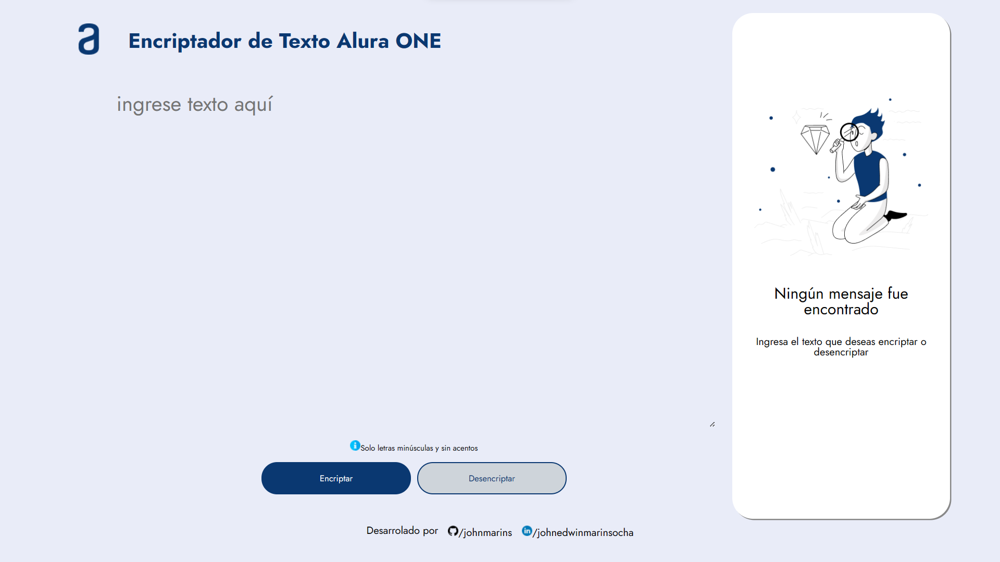
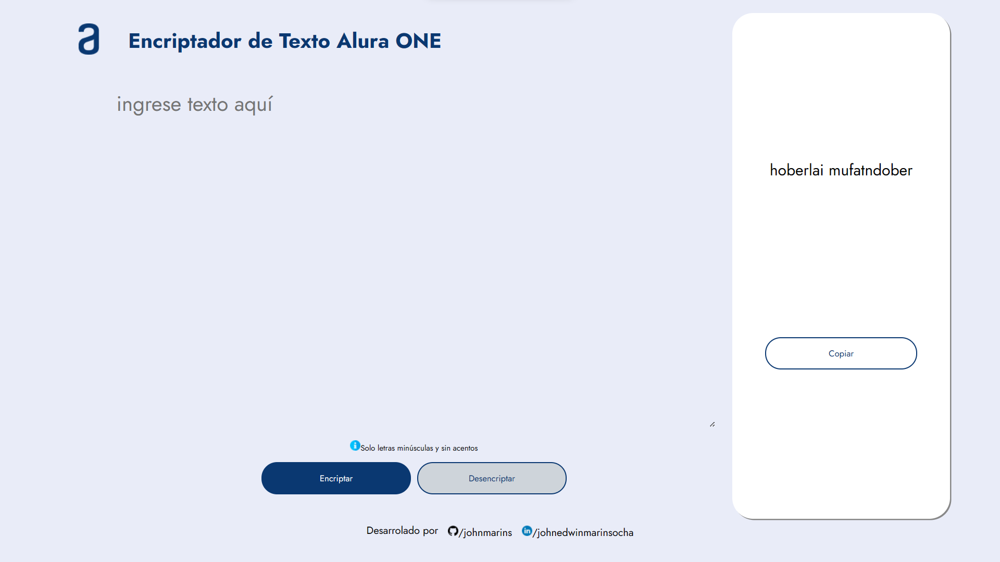

<h1 align="center">Challenge Encriptador de Texto Alura ONE</h1>

    
    

        
        
        
        
        
        
        
        
        
        
    

<h3>Índice</h3>

- [Descripción del proyecto](#descripción-del-proyecto)

- [Estado del proyecto](#estado-del-proyecto)

- [Características de la aplicación y demostración](#caracteristicas)

- [Acceso al proyecto](#acceso-proyecto)

- [Tecnologías utilizadas](#tecnologías-utilizadas)

- [Personas Contribuyentes](#personas-contribuyentes)

- [Personas-Desarrolladores del Proyecto](#personas-desarrolladores)

- [Licencia](#licencia)

- [Conclusión](#conclusión)

<h2 id="descripción-del-proyecto">Descripción del proyecto</h2>

Este proyecto fue creado como propuesta de solución al challenge encriptador del programa de formación ONE de Oracle y Alura Latam. El proyecto consiste en una aplicación web que permite al usuario ingresar una cadena de texto, que es transformada para protegere su legibilidad, y posterior puede ser devuelta al texto original.

<h2 id="estado-del-proyecto">Estado del proyecto</h2>

La primera versión del proyecto se encuentra terminada y es funcional para encriptar y desencriptar textos.

<h2 id="caracteristicas">Características de la aplicación y demostración</h2>

- `Pantalla inicial`: descripción

- `Encriptar` : descripción de la funcionalidad

- `Desencriptar` : descripción de la funcionalidad

- `Copiar` : descripción de la funcionalidad

- `Reiniciar` : descripción de la funcionalidad
