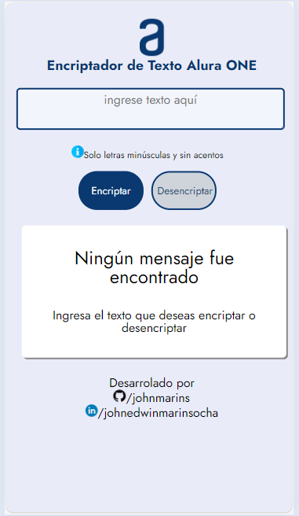

<h1 align="center">Challenge Encriptador de Texto Alura ONE</h1>

    
    

        
        
        
        
        
        
        
        
        
        
    

<h3>Índice</h3>

- [Descripción del proyecto](#descripción-del-proyecto)

- [Estado del proyecto](#estado-del-proyecto)

- [Características de la aplicación y demostración](#caracteristicas)

- [Acceso al proyecto](#acceso-proyecto)

- [Tecnologías utilizadas](#tecnologías-utilizadas)

- [Personas-Desarrolladores del Proyecto](#personas-desarrolladores)

- [Conclusión](#conclusión)

<h2 id="descripción-del-proyecto">Descripción del proyecto</h2>

Este proyecto fue creado como propuesta de solución al challenge encriptador del programa de formación ONE de Oracle y Alura Latam. El proyecto consiste en una aplicación web que permite al usuario ingresar una cadena de texto, que es transformada para proteger su legibilidad, y posterior puede ser devuelta al texto original.

<h2 id="estado-del-proyecto">Estado del proyecto</h2>

La primera versión del proyecto se encuentra terminada y es funcional para encriptar y desencriptar textos.

<h2 id="caracteristicas">Características de la aplicación y demostración</h2>

- `Pantalla inicial`: La aplicación muestra un espacio para ingresar el texto que el usuario desea procesar. También los botones para encriptar y desencriptar según la necesidad.

- `Encriptar` : Ingresar el texto deseado y dar clic en "Encriptar", luego la aplicación mostrará la conversión.

- `Copiar` : Luego de encriptar el texto, puede dar clic en el botón copiar y este se almacenará en el portapapeles.

- `Desencriptar` : Pegue el texto en el area de texto y al dar clic en "Desencriptar" podra visualizar el texto original.

- `Reiniciar` : Si no ha ingresado texto y da clic en los botones "Encriptar" o "Desencriptar", la aplicación regresará al estado inicial mostrando que "Ningún mensaje fue encontrado".

- `Responsive` : La aplicación se adaptará a pantallas de dispostivos de menor dimensión.
 

<h2 id="acceso-proyecto">Acceso al proyecto</h2>
La aplicación se encuentra disponible en GitHub Pages.

<h2 id="tecnologías-utilizadas">Tecnologías utilizadas</h2>

- HTML5

- CSS3

-  Javascript

<h2 id="personas-desarrolladores">Desarrollador del proyecto</h2>
En este proyecto se tomó como base el modelo en Figma propuesto por Alura y el desarrollo e implementación por John Marín --> https://github.com/johnmarins